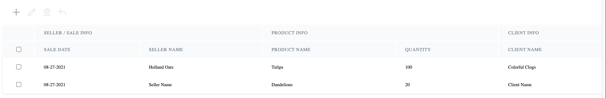
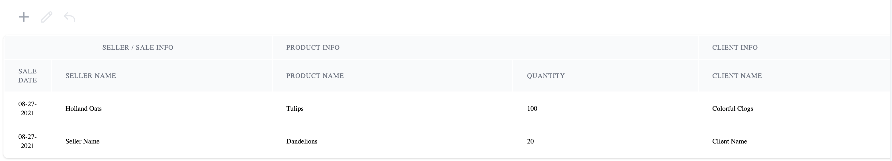

 
# React Table DataTable

This project layers a UI on top of the every popular [React Table](https://react-table.tanstack.com/) library. The intention is to have a drop-in UI solution for most table use cases, while including simple options to override things like theming, sub-components, and actions.
## Demo

[Chromatic Storybook Demo](https://611fe2acceeaf1004a5cef13-ccyodchjma.chromatic.com)





## Usage

```
import { Column, DataTable, DataTableProps } from '@crossroadscx/datatable'

type Person: {
  firstName: string
  lastName: string
  email: string
  phone: string
}

type PersonData = Person & {
  subRows?: PersonData[]
}

const defaultPerson = {
  firstName: null,
  lastName: null,
  email: null,
  phone: null,
}

const data: Person[] = [
  { firstName: 'Bob', lastName: 'Dylan', email: 'thetimes@changin.com', phone: '5555555' },
  { firstName: 'John', lastName: 'Cash', email: 'johnny@folsonblues.com', '5555555' },
]

const columns: Column<PersonData>[] = [
  {
    Header: 'First Name',
    accessor: 'firstName',
  },
  {
    Header: 'Last Name',
    accessor: 'lastName',
  },
  {
    Header: 'Email',
    accessor: 'email,
  },
  {
    Header: 'Phone',
    accessor: 'phone',
  }
]

const handleChange = (data: Person[]) => {
  console.log('Table data changed')
  console.log(data)
}

React.render(<DataTable columns={columns} data={data} defaultItem={defaultPerson} />)
```

## Props

| Name | Type | Required | Default | Description |
| --- | --- | --- | --- | --- |
| data | Array<any> | Yes | - | The incoming data for the table. This borrows from [react-table](https://react-table.tanstack.com/docs/api/useTable#table-options) It should also be annotated with a typescript type as the generic is used throughout the table |
| columns | Array<Column> | Yes | - | This type is the same structure required by [react-table](https://react-table.tanstack.com/docs/api/useTable#table-options) and determines the headers / accessors in the table |
| handleChange | function | Yes | - | This handler is called any time the data in the table changes. This may include edits to a row data or row additions / deletions. |
| defaultItem | Object<T> | No | undefined | The default item object is used to add new rows to the table. This functionality will be disabled if defaultItem is not passed |
| selectable | Boolean | No | false | This prop enables row selection via checkbox inputs in the table |

## Styling
The default UI uses the [TailwindCSS](https://tailwindcss.com/) library for styling, and we use [Styled Components](https://styled-components.com/) as the styling implementation.

Future versions will allow individual style or entire theme overrides.

## Development

### Publish to NPM
1. `yarn build` - build the dist files
1. `git add .` `git commit -m 'build dist'` - Commit new dist files
1. `npm version patch` - create new patch version
1. `git push` - push new version to github
1. `npm version publish` - publish new version to NPM

## License

`@crossroadscx/datatable` is released under the MIT license.
